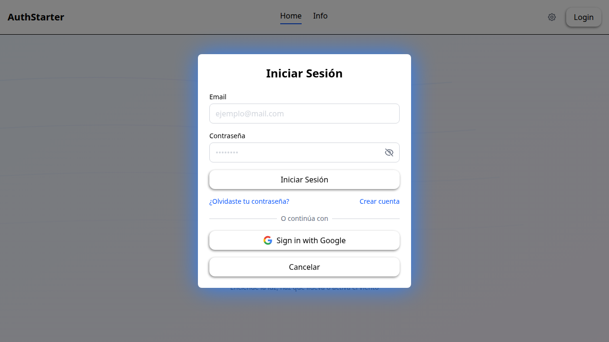
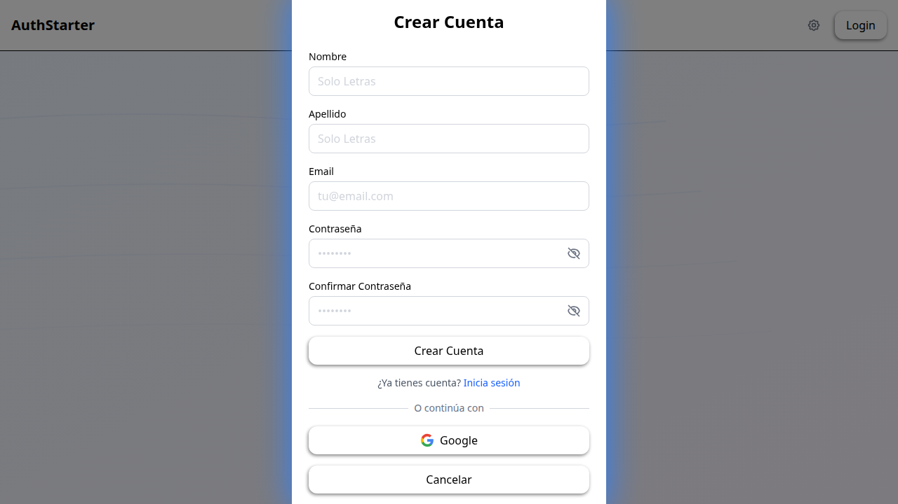
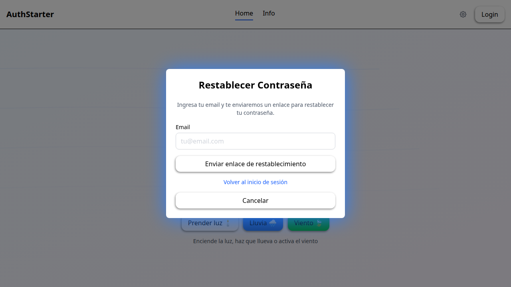
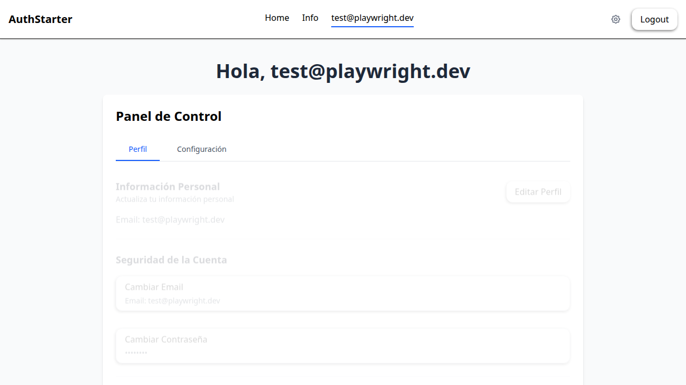
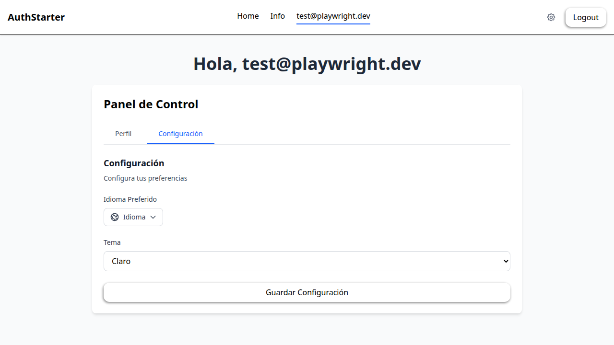
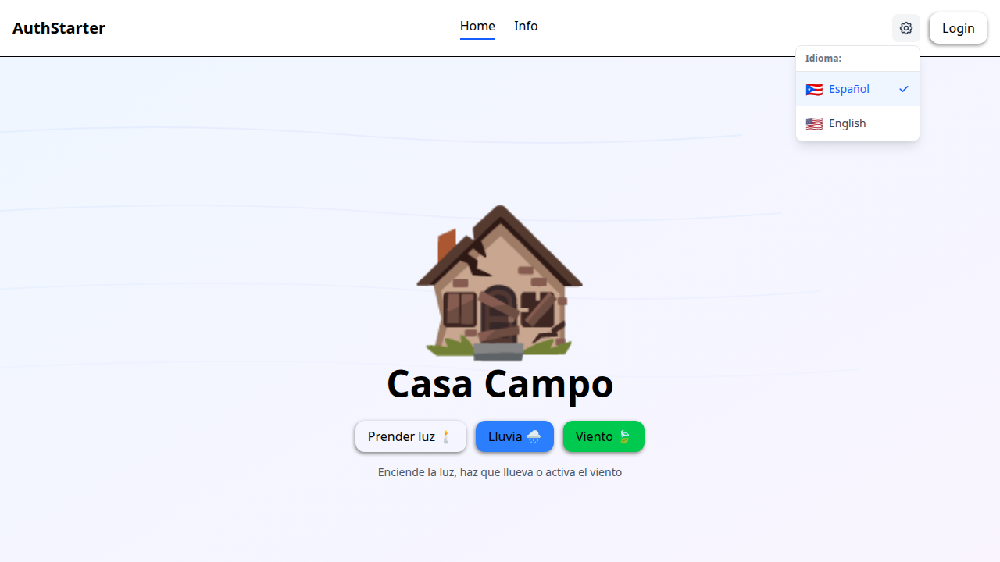
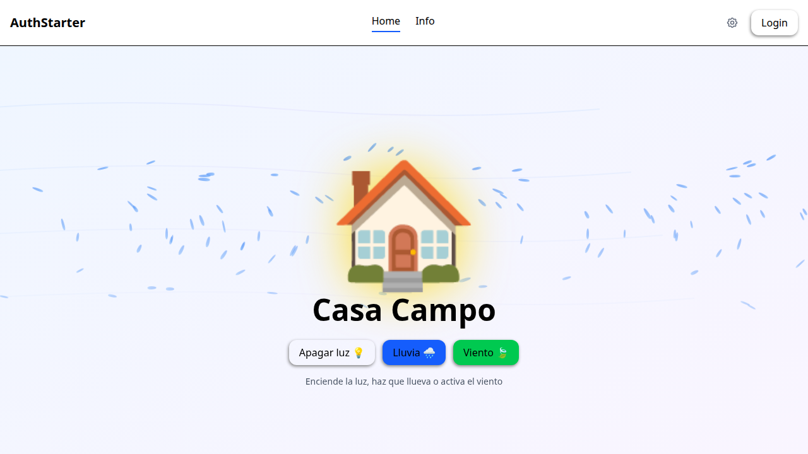
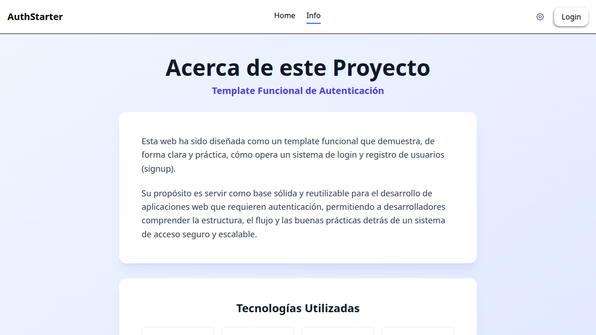

# 🔐 React Supabase Auth Starter

> **A production-ready authentication system template** built with React 19, TypeScript, and Supabase. Save weeks of development time with enterprise-grade security and best practices out of the box.

[](https://react-supabase-auth-starter.vercel.app/)
[](LICENSE)
[](https://react.dev/)
[](https://www.typescriptlang.org/)
[](https://supabase.com/)

[](https://vercel.com/new/clone?repository-url=https%3A%2F%2Fgithub.com%2Fjjmendezrodriguez%2Freact-supabase-auth-starter&env=VITE_SUPABASE_URL,VITE_SUPABASE_ANON_KEY&envDescription=Supabase%20credentials%20needed%20for%20authentication.%20Get%20them%20from%20your%20Supabase%20project%20dashboard.&envLink=https%3A%2F%2Fsupabase.com%2Fdashboard%2Fproject%2F_%2Fsettings%2Fapi&project-name=react-supabase-auth-starter&root-directory=frontEnd)

---

## 🎯 What is React Supabase Auth Starter?

**React Supabase Auth Starter** is a **production-ready authentication system template** designed for developers who want to build modern web applications quickly without sacrificing code quality. It follows senior-level engineering practices and includes everything you need to start a new project.

**🚀 Live Demo:** [https://react-supabase-auth-starter.vercel.app/](https://react-supabase-auth-starter.vercel.app/)

### 📸 Screenshots

|                Home Page                |                   Login Modal                    |                    Signup Modal                    |
| :-------------------------------------: | :----------------------------------------------: | :------------------------------------------------: |
|  |  |  |

|                     Forgot Password                      |                     Dashboard - Profile                      |                      Dashboard - Settings                      |
| :------------------------------------------------------: | :----------------------------------------------------------: | :------------------------------------------------------------: |
|  |  |  |

|                      Language Switcher                       |                 Home (Light On)                  |                  Info Page                   |
| :----------------------------------------------------------: | :----------------------------------------------: | :------------------------------------------: |
|  |  |  |

---

## ✨ Key Features

### 🔐 **Complete Authentication System**

- ✅ Email/Password login with validation
- ✅ Google OAuth integration
- ✅ Password reset flow
- ✅ Account creation with email verification
- ✅ Protected routes with AuthContext
- ✅ Session persistence

### 🎨 **Modern UI/UX**

- ✅ Clean, responsive design with Tailwind CSS v4
- ✅ Smooth animations and transitions
- ✅ Modal-based authentication flow
- ✅ Form validation with real-time feedback
- ✅ Loading states and error handling

### 🌍 **Internationalization (i18n)**

- ✅ English and Spanish support
- ✅ Easy to add new languages
- ✅ Persistent language selection

### 🔒 **Security Best Practices**

- ✅ TypeScript strict mode
- ✅ Input sanitization and validation
- ✅ Secure password handling (Supabase Auth)
- ✅ RLS (Row Level Security) policies
- ✅ Environment variables for secrets
- ✅ CORS protection

### 🧪 **Testing & Quality**

- ✅ Vitest + Testing Library setup
- ✅ Unit tests for utils and hooks
- ✅ Test coverage reporting
- ✅ ESLint + Prettier configuration
- ✅ Pre-commit hooks with Husky

### 🚀 **CI/CD Ready**

- ✅ GitHub Actions workflow
- ✅ Automated testing on PRs
- ✅ Build verification
- ✅ Security audit
- ✅ Deployment to Vercel

---

## 🛠 Tech Stack

| Category         | Technologies                                |
| ---------------- | ------------------------------------------- |
| **Frontend**     | React 19, TypeScript, Vite, Tailwind CSS v4 |
| **Backend**      | Supabase (Auth, Database, RLS)              |
| **Runtime**      | Bun (fastest package manager)               |
| **Testing**      | Vitest, Testing Library, jsdom              |
| **CI/CD**        | GitHub Actions, Vercel                      |
| **Code Quality** | ESLint, Prettier, Husky, lint-staged        |
| **i18n**         | react-i18next                               |

---

## 🚀 Quick Start

### Prerequisites

- [Bun](https://bun.sh/) (recommended) or Node.js 18+
- Supabase account (free tier available)

### Installation

```bash
# Clone the repository
git clone https://github.com/jjmendezrodriguez/react-supabase-auth-starter.git
cd react-supabase-auth-starter

# Navigate to frontend
cd frontEnd

# Install dependencies
bun install

# Set up environment variables
cp .env.example .env
# Edit .env with your Supabase credentials

# Start development server
bun dev
```

Visit `http://localhost:5173` 🎉

---

## 📁 Project Structure

```files
frontEnd/
├── src/
│   ├── components/          # React components
│   │   ├── auth/           # Authentication modals
│   │   └── dashboard/      # User dashboard
│   ├── hooks/              # Custom React hooks
│   ├── services/           # External integrations
│   │   └── supabase/       # Supabase client
│   ├── utils/              # Pure utility functions
│   ├── context/            # React Context providers
│   ├── pages/              # Route pages
│   └── locales/            # i18n translations
├── tests/                  # Test files
├── docs/                   # Documentation
└── .github/workflows/      # CI/CD pipelines
```

See [PROJECT_STRUCTURE.md](frontEnd/PROJECT_STRUCTURE.md) for detailed organization.

---

## 📚 Documentation

- **[AGENTS.md](frontEnd/AGENTS.md)** - AI-assisted development guidelines
- **[SECURITY.md](SECURITY.md)** - Security best practices
- **[CONTRIBUTING.md](CONTRIBUTING.md)** - How to contribute
- **[Frontend README](frontEnd/README.md)** - Detailed frontend documentation

---

## 🧪 Available Scripts

```bash
bun dev          # Start development server
bun build        # Build for production
bun lint         # Run ESLint
bun test         # Run tests in watch mode
bun test:run     # Run tests once
bun test:coverage # Generate coverage report
```

---

## 🔧 Environment Setup

Create a `.env` file in `frontEnd/` (or copy the example):

```bash
cp frontEnd/.env.example frontEnd/.env
```

```env
VITE_SUPABASE_URL=https://your-project.supabase.co
VITE_SUPABASE_ANON_KEY=your-anon-key
```

Get your Supabase credentials from: **[Supabase Dashboard → Settings → API](https://supabase.com/dashboard/project/_/settings/api)**

---

## 🗄️ Database Setup

### 1. Create `profiles` table

```sql
CREATE TABLE profiles (
  id UUID PRIMARY KEY REFERENCES auth.users(id) ON DELETE CASCADE,
  first_name TEXT,
  last_name TEXT,
  email TEXT,
  avatar_url TEXT,
  bio TEXT,
  created_at TIMESTAMPTZ DEFAULT NOW(),
  updated_at TIMESTAMPTZ DEFAULT NOW()
);
```

### 2. Enable Row Level Security (RLS)

```sql
ALTER TABLE profiles ENABLE ROW LEVEL SECURITY;

-- Users can view their own profile
CREATE POLICY "Users can view own profile"
  ON profiles FOR SELECT
  USING (auth.uid() = id);

-- Users can update their own profile
CREATE POLICY "Users can update own profile"
  ON profiles FOR UPDATE
  USING (auth.uid() = id);

-- Users can insert their own profile
CREATE POLICY "Users can insert own profile"
  ON profiles FOR INSERT
  WITH CHECK (auth.uid() = id);
```

### 3. Create Database Triggers

These triggers keep profiles in sync with Supabase Auth:

- **`on_auth_user_created`** — Auto-creates a profile row when a new user signs up
- **`on_auth_user_email_updated`** — Syncs email changes from auth to profiles
- **`on_profile_name_updated`** — Syncs name changes from profiles to auth.users metadata

### 4. Deploy Edge Function (optional)

The `delete-user` Edge Function handles privileged account deletion:

```bash
supabase functions deploy delete-user
```

> **See:** [frontEnd/README.md](frontEnd/README.md#supabase-database-setup) for detailed SQL and trigger definitions.

---

## 📧 Email Templates

Supabase sends automatic emails for authentication events. To customize them:

1. Go to **Supabase Dashboard → Authentication → Email Templates**
2. Edit these templates to match your brand:

   | Template           | When it's sent                        |
   | ------------------ | ------------------------------------- |
   | **Confirm signup** | After user creates an account         |
   | **Reset password** | When user requests password recovery  |
   | **Magic link**     | When using passwordless login         |
   | **Change email**   | When user updates their email address |
   | **Invite user**    | When you invite users via dashboard   |

3. _(Optional)_ Configure custom SMTP for branded email delivery under **Project Settings → Auth → SMTP Settings**

> **Docs:** [Supabase Email Templates](https://supabase.com/docs/guides/auth/auth-email-templates) · [Custom SMTP](https://supabase.com/docs/guides/auth/auth-smtp)

---

## 🤝 Contributing

Contributions are welcome! Please read [CONTRIBUTING.md](CONTRIBUTING.md) for details on our code of conduct and development process.

---

## 📄 License

This project is licensed under the MIT License - see the [LICENSE](LICENSE) file for details.

---

## 👨‍💻 Author

**Jose Mendez**  
💼 [LinkedIn](https://linkedin.com/in/jjmendezrodriguez)  
🐙 [GitHub](https://github.com/jjmendezrodriguez)

---

## 🌟 Show Your Support

If this template helped you save time, give it a ⭐️!
